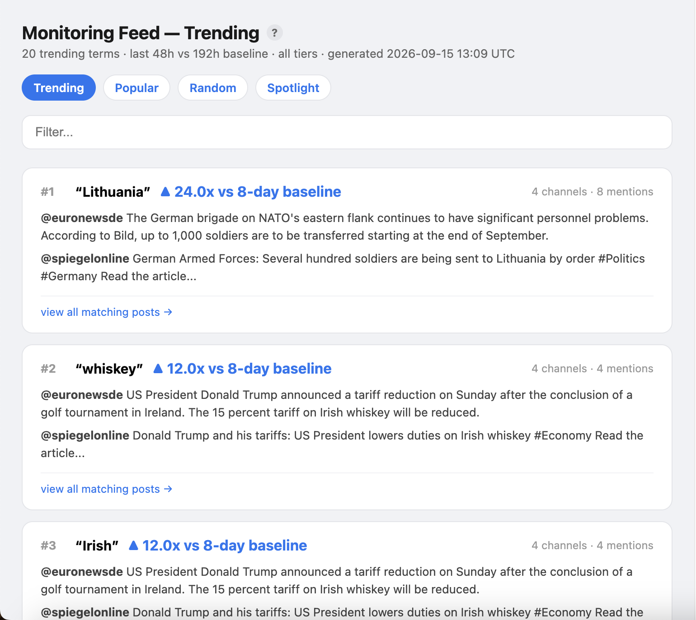
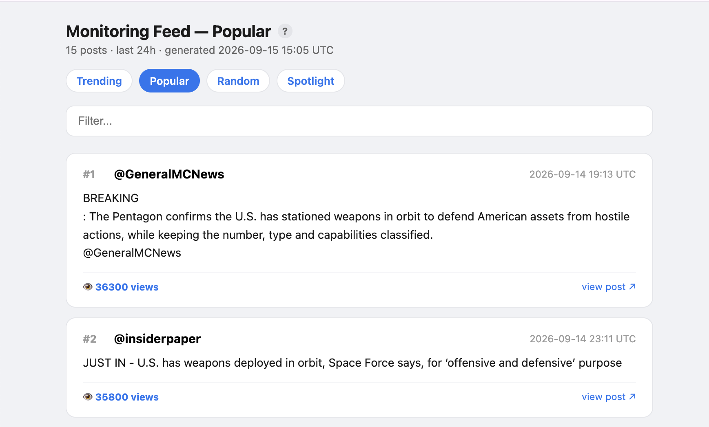
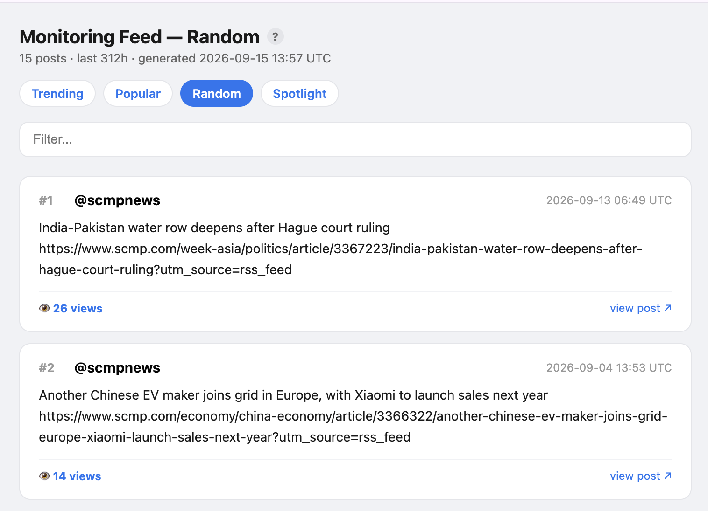
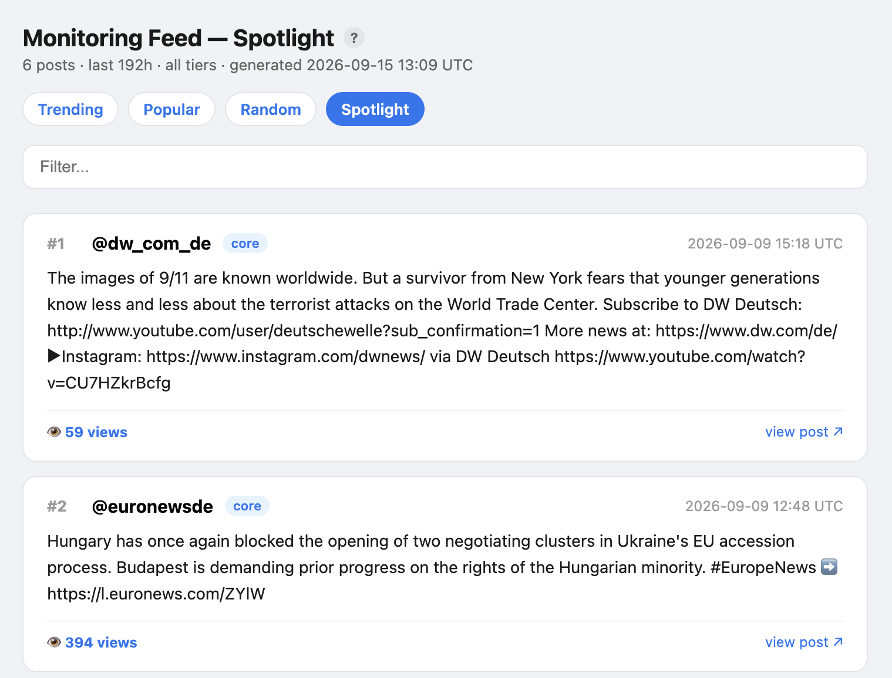

# Telegram Monitoring Feed

Turn a list of Telegram channels into a browsable feed of what's posting,
what's popular, and what's spreading — without opening the Telegram app
once.

## Why this exists

As a disinformation reporter, I'm constantly scanning social media for
viral claims. And yet, time and again, I default to X. I mean yes,
there's a lot of disinformation on X, but that's not why. It's because
(for all its faults) X presents a clean, readable, scrollable feed of
posts. For me, that makes it incredibly easy to monitor.

Enter Telegram. No main feed, just channels. To monitor, you have to know
what channels you're looking at, go into each one individually, read
that channel's feed, exit, and repeat. It's maddening and not a useful
way to monitor.

Instead, I wanted to be able to scroll a searchable, X-like feed of
Telegram posts and quickly see which posts are most popular and which
topics are trending.

This tool is especially nice because you don't even need a Telegram
account, let alone API access or developer credentials. If you give it
the channel names, the tool will scrape directly from that channel's
public webpage (`t.me/s/channelname`) and read what's posted there.
Everything is saved locally to your machine, which makes archival easier
and keeps your data secure.

But, crucially: this tool is only as effective as the channels you give
it to look at. So spend some time developing a good list of channels
you'd like to monitor — more tips on how to do that below.

Happy monitoring!

## Screenshots

**Trending** — a narrative taking off across multiple channels, before it's an obviously "popular" post:



**Popular** — the most-viewed posts right now:



**Random** — a random sample for browsing outside the rankings:



**Spotlight** — each channel's own top post, so small channels aren't buried:



## What it does, in plain terms

- **Scrape** — visits every channel in your list and saves what they've
  posted recently into a small local database on your own computer.
  Nothing is uploaded anywhere.
- **Feed** — turns what's scraped into four browsable web pages:
  - **Trending** — words or phrases spreading across several channels
    right now, more than they normally do. This is the one most likely to
    catch something before it's an obviously "popular" post.
  - **Popular** — the most-viewed posts right now. If the same post got
    copy-pasted across five channels, it's shown once with a badge saying
    so, instead of cluttering the page five times.
  - **Random** — a random sample, so you're not only ever seeing whatever
    the popularity ranking surfaces.
  - **Spotlight** — each channel's own best post, so a quiet channel's
    one interesting post of the day shows up next to a busy channel's
    best post, instead of getting buried underneath it.
- **Search** — full-text search across everything you've ever scraped, by
  keyword and date range, showing chronologically how something spread.
- **Audit** — flags channels in your list that never produced a single
  post, usually a sign the handle is wrong or the channel's gone private.

## Requirements

These instructions are written for macOS, since that's what I use. The
tool itself is plain Python and runs the same way on Windows or Linux —
each macOS step below has a matching Windows dropdown right after it, if
that's what you're on.

- **Terminal** — the app where you'll type commands. Open it via
  Applications → Utilities → Terminal, or press `⌘ Space`, type
  "Terminal," and press Return.

  Throughout this README, gray boxes like the one below hold commands.
  Copy the text, paste it into Terminal, and press Return to run it:

  ```bash
  echo "like this"
  ```

  <details>
  <summary>Using Windows instead?</summary>

  Press the Windows key, type **Command Prompt**, and press Enter — that's
  your equivalent of Terminal for every step below.

  </details>

- **Python 3.10 or newer.** Check what you have by typing this into
  Terminal and pressing Return:

  ```bash
  python3 --version
  ```

  If it says 3.10 or higher, you're set. If it's older or missing,
  download the installer from [python.org](https://www.python.org/downloads/)
  and run it like any other Mac app.

  <details>
  <summary>Using Windows instead?</summary>

  Check your version with `python --version` (no `3`) instead. If it's
  older than 3.10 or missing, download the installer from
  [python.org](https://www.python.org/downloads/) — **on the first
  install screen, check the box that says "Add python.exe to PATH,"**
  or the `python` command won't be found afterward.

  From here on, anywhere this README says a command starting with
  `python3`, use `python` (no `3`) instead — that's the only difference
  for the rest of Setup and Usage, beyond what's called out in its own
  dropdown below.

  </details>

## Install

**If you don't use git (the easiest path for most people):**

1. Click the green **Code** button near the top of this page, then
   **Download ZIP**.
2. Find the downloaded file — usually in your **Downloads** folder — and
   double-click it to unzip. This creates a folder called
   `telegram-feed-main`.
3. In Terminal, move into that folder:

   ```bash
   cd ~/Downloads/telegram-feed-main
   ```

   (If you moved the folder somewhere else first, like the Desktop, use
   that path instead — e.g. `cd ~/Desktop/telegram-feed-main`.)

   <details>
   <summary>Using Windows instead?</summary>

   Unzip by right-clicking the downloaded file and choosing **Extract
   All**, then move into the folder with:

   ```bat
   cd %USERPROFILE%\Downloads\telegram-feed-main
   ```

   (or `cd %USERPROFILE%\Desktop\telegram-feed-main` if you moved it to
   the Desktop first, etc.)

   </details>

**If you use git instead:**

```bash
git clone https://github.com/joshdaxelrod/telegram-feed.git
cd telegram-feed
```

(Identical on every OS.)

**From here, both paths continue the same way.**

## Setup

First, create a private, self-contained copy of Python just for this tool
(called a "virtual environment"). This avoids two common problems: newer
Macs often refuse to let you install packages directly ("externally
managed environment" errors), and if your computer has more than one
copy of Python installed, it keeps this tool from accidentally using the
wrong one.

```bash
python3 -m venv venv
source venv/bin/activate
```

<details>
<summary>Using Windows instead?</summary>

**Command Prompt:**
```bat
python -m venv venv
venv\Scripts\activate
```

**PowerShell:** same, but activate with `venv\Scripts\Activate.ps1`
instead. If PowerShell refuses to run it with an "execution policies"
error, run this once, then try activating again:
`Set-ExecutionPolicy -Scope CurrentUser RemoteSigned`.

</details>

You'll know it worked because your prompt now starts with `(venv)`. Do
this once per terminal session — any time you close the terminal and come
back later to use the tool, run the activate command again first (from
inside the project folder) before running any of the commands below.

Now install the two small libraries this tool depends on:

```bash
python3 -m pip install -r requirements.txt
```

<details>
<summary>Using Windows instead?</summary>

```bat
python -m pip install -r requirements.txt
```

</details>

`pip` is Python's package installer — this downloads two small helper
libraries (`requests`, for fetching web pages, and `beautifulsoup4`, for
reading what's on them) onto your computer. If you see text scroll by
ending in something like "Successfully installed," it worked.

Next, create your own list of channels to monitor. A template is
included:

```bash
cp channels.example.csv channels.csv
```

<details>
<summary>Using Windows instead?</summary>

```bat
copy channels.example.csv channels.csv
```

</details>

Open `channels.csv` in any spreadsheet app (Numbers, Excel, Google
Sheets) or a plain text editor, and replace the example rows with your
own channels — one handle per line:

```csv
handle
somechannel
otherchannel
```

A channel's **handle** is the part of its Telegram link after `t.me/` —
if a channel's link is `t.me/somechannel`, its handle is `somechannel`.

`channels.csv` is set up to stay only on your computer — it never gets
uploaded anywhere, including to GitHub, even if you download updates to
the tool later. That's on purpose: it's your own research list.

**That's it — you're installed.** Everything from here (Usage, below) is
just running the tool, not setting it up again.

## Finding channels to monitor

This tool is only as good as the list you give it — it doesn't discover
anything on its own, it just watches the channels you already know about.
For this tool to be helpful, you'll need to spend a couple hours
developing a good dataset. A few ways I actually build that list:

- **Follow the forwards.** Once you've found one relevant channel, check
  what it reposts from and who reposts it. Telegram shows the original
  source on any forwarded message, which is usually the fastest way to
  map out a whole network starting from a single channel.
- **Search Telegram itself.** Telegram's in-app search can surface
  channels by keyword or topic. Personally, I dislike Telegram search and
  find it hard to find channel names this way.
- **Look for existing research.** Depending on your beat, researchers,
  NGOs, or academic projects sometimes maintain curated, categorized
  channel lists (for extremism, disinformation, election monitoring, and
  so on, in a given country or language). Search for one relevant to your
  beat before building a list from scratch. You can also reach out to
  researchers and ask if they'd consider sharing a dataset! Researchers
  are nice, especially if you're on a similar beat.
- **Watch who officials and outlets link to.** Politicians, movement
  figures, and partisan outlets often plug their own or allied channels
  in posts, bios, or on other platforms.
- **Revisit the list periodically.** Channels go private, get deleted, or
  get replaced by a "backup channel" after a ban. `audit_channels.py`
  (see below) catches channels that have gone dead, but it won't find new
  ones for you — that part stays a human judgment call.

## Usage

Everything below has to be run from inside the project folder — the same
one you moved into during Install (the one containing this README,
`scraper.py`, and so on). **Every time you open a new Terminal window,
you need to redo two things first, in this order, before any command
below will work:**

**1. Navigate back into the project folder**, using `cd` followed by its
path — the same one you used during Install. For example, if you used
the ZIP method:

```bash
cd ~/Downloads/telegram-feed-main
```

(Use whatever path is actually correct for you — wherever you unzipped
it, or wherever you ran `git clone` if you used git instead.)

**2. Activate the virtual environment from Setup.** If your prompt
doesn't already start with `(venv)`, run:

```bash
source venv/bin/activate
```

<details>
<summary>Using Windows instead?</summary>

For step 1, `cd` works the same way, just with a Windows-style path, e.g.
`cd %USERPROFILE%\Downloads\telegram-feed-main`. For step 2, activate
with `venv\Scripts\activate` (Command Prompt) or
`venv\Scripts\Activate.ps1` (PowerShell) instead. Every command below is
also written as `python3 ...` — use `python ...` (drop the `3`) for all
of them.

</details>

### 1. Scrape

```bash
python3 scraper.py
```

This visits every channel in `channels.csv` and saves their posts from
the last 24 hours into a local file, `data/messages.db`. You'll see a
line per channel (e.g. `guardian: 146 new messages`) as it goes — when
it prints `Done.`, it's finished.

To look further back:

```bash
python3 scraper.py --hours 72     # last 3 days instead of 24 hours
```

**The first time you set this up, scrape a full week instead of a day:**

```bash
python3 scraper.py --hours 168    # once, when you're starting out
```

Here's why: the Trending page (below) works by comparing how often a term
comes up *right now* against how often it normally comes up over the
past 7 days. If your database only has a day of history in it, there's
no real "normal" to compare against, and Trending will show nonsense —
everything looks like an "infinite spike," including plain grammar,
because there's nothing behind it. One bigger scrape up front fixes
this for good. After that, your regular daily (or however often you
like) scrapes keep that history continuously topped up. If a real gap
ever does open up (you stop scraping for a while, then pick it back up),
just run the `--hours 168` backfill again.

### 2. Generate the feed

```bash
python3 feed.py
```

This reads what you've scraped, writes four web pages into a `data/`
folder, and opens one of them in your browser automatically. Use the tabs
at the top of the page to switch between Trending, Popular, Random, and
Spotlight — each one also has a search box, and hovering the "?" next to
the title explains what that page is showing.

To regenerate for a different window:

```bash
python3 feed.py --hours 48
```

### 3. Search everything you've ever scraped

```bash
python3 trace.py "some name or phrase"
```

This opens a page in your browser, in the same style as the feed pages,
listing every post that matches — oldest first, each labeled with how long
after the first post it appeared (`first`, `+2.5h`, …) — so you can see
exactly when and where something started spreading. Like the feed pages,
it has a filter box, and each card links to the original post.

The feed pages' filter boxes only search the posts on that page; this
searches everything in your database, looking back 7 days by default. To
go further back:

```bash
python3 trace.py "some name or phrase" --hours 720    # last 30 days
```

Add `--terminal` if you'd also like the results printed in Terminal.

### 4. Clean up dead channels

```bash
python3 audit_channels.py
```

Flags channels in your list that haven't produced a single scraped
message — usually a wrong handle, or a channel that's gone private or
been deleted. To remove those flagged channels from `channels.csv`
automatically (it asks you to confirm first), run:

```bash
python3 audit_channels.py --prune
```

## Where your data lives

Everything gets written into a `data/` folder, which is left out of the
repository — it's your scraped data, not part of the tool itself.

- **`data/messages.db`** is the database every scraped post goes into.
  Running the scraper again doesn't overwrite or duplicate anything — it
  just adds newly-seen posts and quietly skips ones it's already saved,
  so this file only ever grows. Nothing here is cleaned up automatically;
  if it gets too big, you can delete it and start fresh, but there's no
  getting back history you didn't capture at the time — Telegram's
  preview pages only show recent posts.
- **The feed pages** (`data/popular.html`, `data/trending.html`, and so
  on, plus their matching `.csv` files) are different: each one is a
  snapshot of "right now." Running `feed.py` again completely overwrites
  whichever feed you regenerate. If you want to keep a particular page
  around for reference, copy the file elsewhere first.

## Customizing for your channels

You'll likely want to adjust two things once you know what your own
channels actually look like. Both work the same way: add a plain text
file with your own words or phrases in it, one per line, and it gets
picked up automatically.

**Filtering out ads and spam — `filters.local.txt`.** `filters.py`
drops ads and "subscribe to our backup channel" spam from the feeds
using a built-in list of English example phrases (things like
`"subscribe now"` or `"buy now"`). If your channels use different spam
phrases — in English or any other language — create a file called
`filters.local.txt` in this same folder, and put one spam phrase per
line:

```
jetzt abonnieren
folgt uns auf
```

Any post containing one of those phrases gets filtered out, in addition
to the built-in examples. Lines starting with `#` are ignored, so you
can leave yourself notes. An AI assistant can help you build this list:
paste in a handful of real ad/promo posts from your own channels and ask
something like *"what phrases in here are advertising or 'subscribe to
our channel' spam? List each one on its own line, exactly as it
appears"* — it's often faster at spotting the pattern across examples
than doing it by eye.

**Filtering out grammar so Trending shows real topics —
`stopwords.local.txt`.** `trends.py` uses a similar built-in list of
common English filler words ("the," "and," "also") — words that are so
common they get ignored, so the Trending page surfaces actual topics
instead of grammar. If your channels post in a language other than
English, this list won't catch that language's filler words, and
Trending will fill up with meaningless function words instead of real
topics. Fix it the same way: create a file called `stopwords.local.txt`,
one filler word per line:

```
der
die
und
```

The fastest way to fill this in: ask an AI assistant like Claude or
ChatGPT something like *"give me the 300 most common French filler
words — articles, pronouns, conjunctions, prepositions, and every common
form of 'to be' and 'to have' — one per line, all lowercase"* and paste
the answer straight into the file. Aim high rather than low: a real
stopword list needs a few hundred words to actually work (off-the-shelf
English/German lists from libraries like NLTK run 200–600+ words), and
it's much faster to trim a list that's too aggressive than to keep
finding one leaked word at a time.

Either way, save the file and run the tool again — `python3 trends.py`
or `python3 feed.py` for stopwords, `python3 feed.py` for filters. If
Trending is still mostly grammar instead of real topics, you're missing
some common words; add them the same way.

If you're monitoring channels in a language you don't read yourself, you
don't need to translate anything by hand: Chrome's built-in translate
feature (right-click anywhere on the page → Translate to English) works
on these feed pages the same as it does on any other website.

## A note on scraping etiquette

The scraper visits many channels' pages at once (10 at a time, by
default), automatically. Doing that in moderation is completely normal;
doing it too aggressively (an enormous channel list, or running it
constantly) can start to look like the kind of automated traffic a
website tries to block, and Telegram could begin refusing your requests
if it decides you're hitting it too hard.

In practice: keep your channel list to what you actually need rather than
adding channels you might not use, and don't run the scraper more often
than your work actually requires — every few hours is usually plenty;
once a minute is not. If you start seeing a lot of `request error` or
`HTTP ...` warnings in the scraper's output where you didn't before, that's a sign
to slow down: open `scraper.py` and lower the `WORKERS` number near the
top of the file (10 by default) so fewer requests go out at once.

## Limitations

Being upfront about what this can't do:

- **Public channels only.** There's no public preview page for a private
  group or chat, so there's nothing to scrape.
- **Search is literal.** `trace.py` and the search boxes match exact
  text, not variant spellings, typos, or paraphrases.
- **View counts aren't a verified fact.** They're the only reach signal
  public scraping can get, and they can be inflated. Treat "Popular" as a
  starting point for your own judgment, not a finding in itself.
- **The Trending page needs tuning to your channel list size.** It only
  counts a term as trending if it shows up on several *different*
  channels, not just several posts — otherwise one copy-pasted post reads
  as a fake spike. What counts as "several" depends on how many channels
  you're watching; if Trending comes back empty, try
  `python3 trends.py --min-channels 2` and raise it from there.
- **Trending doesn't work on non-Latin scripts.** It splits text into
  words using a pattern that only matches Latin letters (English,
  German, French, and similar). Channels posting in Arabic, Russian,
  Chinese, or another non-Latin script will tokenize to nothing, so
  Trending will always come back empty for them — Popular, Random, and
  Spotlight are unaffected, since they don't need to split text into
  words at all.

## License

MIT — see [LICENSE](LICENSE).

Built with AI assistance (Claude), reviewed and tested by me.

## About

Written by [Josh Axelrod](https://josh-axelrod.com), an investigative
reporter and 2023–24 Fulbright Journalism Fellow based in Berlin,
Germany. He covers extremism, disinformation, and technology; his work
has appeared in WIRED, Mother Jones, Deutsche Welle, Die Zeit, The Daily
Beast, NPR, and more.
